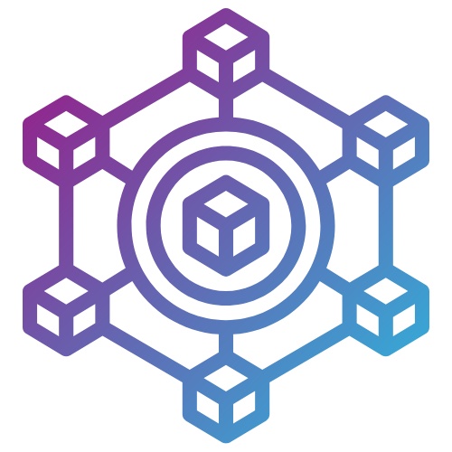

# Gather3 Rollup Integration 🌐

## Transforming Event Experiences with Blockchain Technology 🚀

Gather3 is an innovative platform that combines **events, blockchain, and social networking** 🎟️🔗👥, allowing participants to securely acquire tickets, validate their attendance, and receive **exclusive NFT certificates** of participation. Users can build a **social profile** showcasing their attended events, follow friends, and interact with organizers.

Event organizers can promote their events, manage tickets, and create direct connections with their followers, making the experience more engaging and decentralized.

### Leveraging Espresso Network and Open Intent 🌍

Gather3 utilizes the [Espresso Network](https://docs.espressosys.com/network/learn/the-espresso-network) to ensure fast, secure, and cross-chain transactions. The Espresso Network's HotShot consensus mechanism provides rapid confirmations and enhanced security, crucial for the integrity of NFT ticketing and real-time event validation.

Furthermore, by integrating with [Across Protocol](https://docs.across.to/introduction/what-is-across) using an intents-based architecture, Gather3 allows users to seamlessly perform cross-chain interactions without needing to manage complex blockchain-specific details. This approach not only simplifies the user experience but also reduces transaction costs and increases efficiency, making blockchain interactions accessible to a broader audience.

These technologies empower Gather3 to offer a decentralized and user-centric platform, transforming how participants and organizers experience events in the blockchain space.

## Project Status 📈

Gather3 is a visionary project that has already seen partial implementation:

- **Espresso Network Rollup**: Successfully deployed on both testnet and mainnet.
- **Frontend Integration**: Operational on a specific blockchain network. [Block Fest](https://block-fest.vercel.app/), developed during a previous blockchain hackathon, is currently operational but does not yet feature rollup capabilities or cross-chain wallet integration, limiting its functionality to a single blockchain environment.

## Purpose 🎯

Gather3 aims to **transform how people participate and interact in Web3 and blockchain events**, bringing more **transparency, authenticity, and engagement** to the sector. The platform:

✅ Ensures **authentic tickets** and eliminates fraud using blockchain technology.

✅ Allows participants to **build a digital identity** through their event NFTs.

✅ Creates an **interactive ecosystem** where organizers and participants connect more dynamically.

✅ Offers new opportunities for **monetization and networking** within the Web3 universe.

Gather3 is not just a ticket marketplace, but a **hub of experiences, innovation, and community** within the blockchain revolution.

## Technical Architecture 🛠️

### NFT Ticketing System

Our platform leverages blockchain technology to issue two types of NFT tickets:

- **Instant issuance** for paid events - tickets are minted immediately upon purchase
- **Batch issuance** for free events - tickets are minted in batches at predetermined dates

### Powered by Espresso Network

Gather3 utilizes the [Espresso Network](https://docs.espressosys.com/network/learn/the-espresso-network) as its Global Confirmation Layer, providing several key benefits:

- **Fast confirmations** - Transactions are confirmed within seconds through HotShot consensus
- **Cross-chain compatibility** - Seamless interaction between different blockchain networks
- **Enhanced security** - Transactions are secured by a decentralized network with BFT consensus
- **Scalability** - Handles high transaction volumes required for large-scale events
- **Trustless verification** - No need to rely on centralized sequencers for transaction confirmations

The Espresso Network's HotShot consensus protocol provides security guarantees similar to Ethereum L1, making it ideal for our ticketing system where transaction integrity is crucial.

### Intents-Based Architecture with Across Protocol

We integrate with [Across Protocol](https://docs.across.to/introduction/what-is-across) to enable seamless cross-chain interactions through an intents-based architecture:

- **Improved user experience** - Users can express desired outcomes without specifying technical steps
- **Fast transaction execution** - Relayers compete to fulfill orders quickly and efficiently
- **Cross-chain compatibility** - Seamless bridging between different blockchain networks
- **Lower costs** - Reduced fees compared to traditional message-passing solutions
- **Enhanced security** - Secure settlement layer for verifying transaction completion

## Key Features 🔑

- **Secure NFT Tickets**: Blockchain-verified event tickets that cannot be counterfeited
- **Social Profiles**: User profiles showcasing attended events and earned NFTs
- **Organizer Dashboard**: Tools for event creation, ticket management, and audience engagement
- **Real-time Tracking**: Monitor NFT ticket issuance and transfers in real-time
- **Cross-chain Compatibility**: Support for multiple blockchain networks
- **Community Building**: Follow friends, discover events, and connect with organizers
